# Atheria — Simplified Architecture (Non-Technical)

This diagram shows how Atheria works at a high level, using plain language.

## How it works

```mermaid
flowchart LR
    subgraph input["📄 Input"]
        P[Papers / articles]
    end

    subgraph prepare["⚙️ Prepare"]
        Parse[Read & structure]
        Chunk[Break into sections]
        Index[Make searchable]
    end

    subgraph use["🔍 Use"]
        Query[Your question]
        Search[Find best matches]
        Results[Relevant sections + evidence]
    end

    P --> Parse --> Chunk --> Index
    Query --> Search
    Index --> Search
    Search --> Results
```

## In words

| Step | What happens |
|------|----------------|
| **Papers** | You add scientific papers (e.g. from PubMed) in a standard format. |
| **Read & structure** | The system reads each paper and understands titles, sections, tables, and captions. |
| **Break into sections** | Text is split into meaningful pieces (paragraphs, table captions, etc.) so we can point to specific places. |
| **Make searchable** | Those pieces are turned into a “search index” so the system can quickly find what matches a question. |
| **Your question** | You type a question (e.g. “electrophysiology assessment metrics”). |
| **Find best matches** | The system compares your question to the index and picks the most relevant sections. |
| **Relevant sections + evidence** | You get a list of sections with exact quotes, section names, and page numbers. |

## Two main phases

- **One-time setup (left side):** Papers go in → they get parsed, chunked, and indexed. This is the “prepare” phase.
- **Every search (right side):** You ask a question → the system uses the index to return the best sections with evidence. This is the “use” phase.

You can share this diagram in slides or docs; the Mermaid code above renders in GitHub, GitLab, and many markdown viewers.

---

## Minimal one-slide view

```mermaid
flowchart TB
    A[📄 Papers] --> B[⚙️ Process & organize]
    B --> C[📚 Searchable index]
    D[❓ Your question] --> E[🔍 Search]
    C --> E
    E --> F[📋 Relevant sections + quotes]
```

*Left: one-time setup. Right: every search.*
